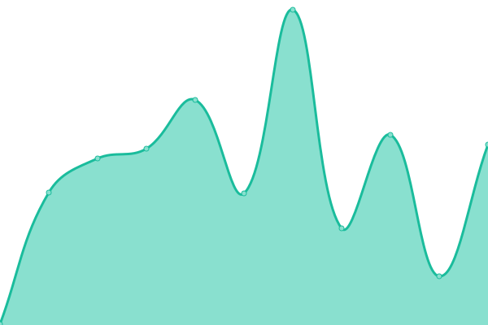

# [📈 Live Status](https://scriptex.github.io/uptime): <!--live status--> **🟩 All systems operational**

This repository contains the open-source uptime monitor and status page for [Atanas Atanasov](https://atanas.info), powered by [Upptime](https://github.com/upptime/upptime).

With [Upptime](https://upptime.js.org), you can get your own unlimited and free uptime monitor and status page, powered entirely by a GitHub repository. We use [Issues](https://github.com/scriptex/uptime/issues) as incident reports, [Actions](https://github.com/scriptex/uptime/actions) as uptime monitors, and [Pages](https://scriptex.github.io/uptime) for the status page.

<!--start: status pages-->
<!-- This summary is generated by Upptime (https://github.com/upptime/upptime) -->
<!-- Do not edit this manually, your changes will be overwritten -->
<!-- prettier-ignore -->
| URL | Status | History | Response Time | Uptime |
| --- | ------ | ------- | ------------- | ------ |
|  [Atanas](https://atanas.info) | 🟩 Up | [atanas.yml](https://github.com/scriptex/uptime/commits/HEAD/history/atanas.yml) | 

 383ms
     
 | 

<a href="https://scriptex.js.org/uptime/history/atanas">100.00%</a>
    

|  [Github](https://github.com) | 🟩 Up | [github.yml](https://github.com/scriptex/uptime/commits/HEAD/history/github.yml) | 

 238ms
     
 | 

<a href="https://scriptex.js.org/uptime/history/github">100.00%</a>
    

|  [ITCSS](https://itcss.atanas.info) | 🟩 Up | [itcss.yml](https://github.com/scriptex/uptime/commits/HEAD/history/itcss.yml) | 

 234ms
     
 | 

<a href="https://scriptex.js.org/uptime/history/itcss">100.00%</a>
    

|  [ITSCSS](https://itscss.atanas.info) | 🟩 Up | [itscss.yml](https://github.com/scriptex/uptime/commits/HEAD/history/itscss.yml) | 

 246ms
     
 | 

<a href="https://scriptex.js.org/uptime/history/itscss">100.00%</a>
    

|  [At the Wall](https://at-the-wall.atanas.info) | 🟩 Up | [at-the-wall.yml](https://github.com/scriptex/uptime/commits/HEAD/history/at-the-wall.yml) | 

 369ms
     
 | 

<a href="https://scriptex.js.org/uptime/history/at-the-wall">100.00%</a>
    

|  [SCSS Goodies](https://scss-goodies.atanas.info) | 🟩 Up | [scss-goodies.yml](https://github.com/scriptex/uptime/commits/HEAD/history/scss-goodies.yml) | 

 306ms
     
 | 

<a href="https://scriptex.js.org/uptime/history/scss-goodies">100.00%</a>
    

|  [Github Insights](https://github-insights.atanas.info) | 🟩 Up | [github-insights.yml](https://github.com/scriptex/uptime/commits/HEAD/history/github-insights.yml) | 

 203ms
     
 | 

<a href="https://scriptex.js.org/uptime/history/github-insights">100.00%</a>
    

|  [URL Shortener](https://atanas.ml) | 🟩 Up | [url-shortener.yml](https://github.com/scriptex/uptime/commits/HEAD/history/url-shortener.yml) | 

 418ms
     
 | 

<a href="https://scriptex.js.org/uptime/history/url-shortener">99.91%</a>
    

|  [TypeScript Helpers](https://ts-helpers.atanas.info) | 🟩 Up | [type-script-helpers.yml](https://github.com/scriptex/uptime/commits/HEAD/history/type-script-helpers.yml) | 

 271ms
     
 | 

<a href="https://scriptex.js.org/uptime/history/type-script-helpers">99.92%</a>
    

|  [Animate Me](https://animate-me.atanas.info) | 🟩 Up | [animate-me.yml](https://github.com/scriptex/uptime/commits/HEAD/history/animate-me.yml) | 

 164ms
     
 | 

<a href="https://scriptex.js.org/uptime/history/animate-me">99.93%</a>
    

|  [Material Snake](https://snake.atanas.info) | 🟩 Up | [material-snake.yml](https://github.com/scriptex/uptime/commits/HEAD/history/material-snake.yml) | 

 225ms
     
 | 

<a href="https://scriptex.js.org/uptime/history/material-snake">99.94%</a>
    

|  [Material Tetris](https://tetris.atanas.info) | 🟩 Up | [material-tetris.yml](https://github.com/scriptex/uptime/commits/HEAD/history/material-tetris.yml) | 

 292ms
     
 | 

<a href="https://scriptex.js.org/uptime/history/material-tetris">99.94%</a>
    

|  [Interactive Resume (WIP)](https://interactive-resume.atanas.info) | 🟩 Up | [interactive-resume-wip.yml](https://github.com/scriptex/uptime/commits/HEAD/history/interactive-resume-wip.yml) | 

 148ms
     
 | 

<a href="https://scriptex.js.org/uptime/history/interactive-resume-wip">99.95%</a>
    

<!--end: status pages-->

[**Visit our status website →**](https://scriptex.github.io/uptime)

## 📄 License

- Powered by: [Upptime](https://github.com/upptime/upptime)
- Code: [MIT](./LICENSE) © [Atanas Atanasov](https://atanas.info)
- Data in the `./history` directory: [Open Database License](https://opendatacommons.org/licenses/odbl/1-0/)
