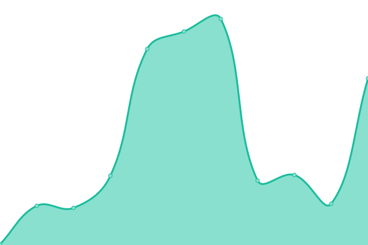
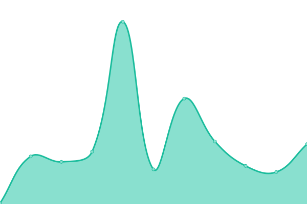
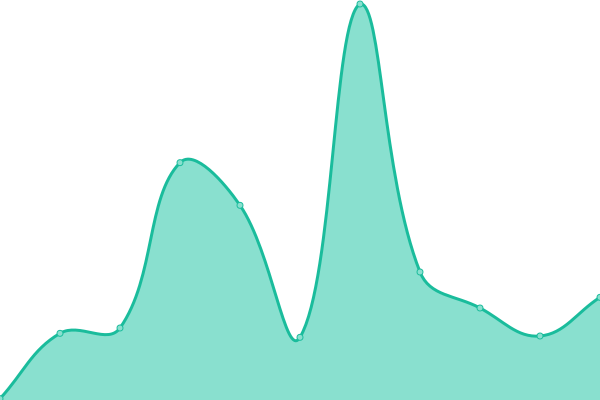
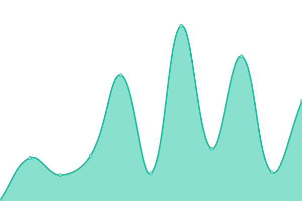
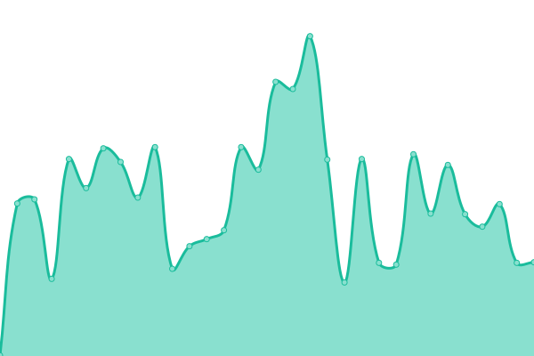
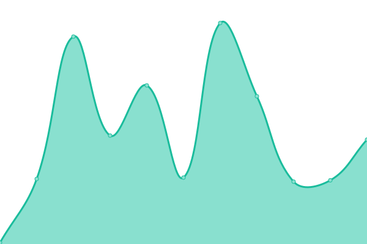
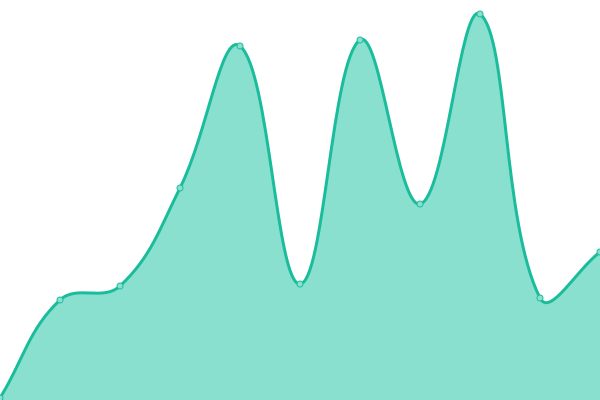

# [📈 Live Status](https://scriptex.github.io/uptime):  <!--live status--> **🟩 All systems operational**

This repository contains the open-source uptime monitor and status page for [Atanas Atanasov](https://atanas.info), powered by [Upptime](https://github.com/upptime/upptime).

With [Upptime](https://upptime.js.org), you can get your own unlimited and free uptime monitor and status page, powered entirely by a GitHub repository. We use [Issues](https://github.com/scriptex/uptime/issues) as incident reports, [Actions](https://github.com/scriptex/uptime/actions) as uptime monitors, and [Pages](https://scriptex.github.io/uptime) for the status page.

<!--start: status pages-->
<!-- This summary is generated by Upptime (https://github.com/upptime/upptime) -->
<!-- Do not edit this manually, your changes will be overwritten -->
<!-- prettier-ignore -->
| URL | Status | History | Response Time | Uptime |
| --- | ------ | ------- | ------------- | ------ |
|  [Atanas](https://atanas.info) | 🟩 Up | [atanas.yml](https://github.com/scriptex/uptime/commits/HEAD/history/atanas.yml) | 

 319ms
     
 | 

<a href="https://scriptex.js.org/history/atanas">98.66%</a>
    

|  [ITCSS](https://itcss.atanas.info) | 🟩 Up | [itcss.yml](https://github.com/scriptex/uptime/commits/HEAD/history/itcss.yml) | 

 255ms
     
 | 

<a href="https://scriptex.js.org/history/itcss">98.68%</a>
    

|  [ITSCSS](https://itscss.atanas.info) | 🟩 Up | [itscss.yml](https://github.com/scriptex/uptime/commits/HEAD/history/itscss.yml) | 

 247ms
     
 | 

<a href="https://scriptex.js.org/history/itscss">98.71%</a>
    

|  [At the Wall](https://at-the-wall.atanas.info) | 🟩 Up | [at-the-wall.yml](https://github.com/scriptex/uptime/commits/HEAD/history/at-the-wall.yml) | 

 331ms
     
 | 

<a href="https://scriptex.js.org/history/at-the-wall">98.73%</a>
    

|  [SCSS Goodies](https://scss-goodies.atanas.info) | 🟩 Up | [scss-goodies.yml](https://github.com/scriptex/uptime/commits/HEAD/history/scss-goodies.yml) | 

 232ms
     
 | 

<a href="https://scriptex.js.org/history/scss-goodies">98.76%</a>
    

|  [Github Insights](https://github-insights.atanas.info) | 🟩 Up | [github-insights.yml](https://github.com/scriptex/uptime/commits/HEAD/history/github-insights.yml) | 

 213ms
     
 | 

<a href="https://scriptex.js.org/history/github-insights">99.46%</a>
    

|  [URL Shortener](https://shortener.atanas.info) | 🟩 Up | [url-shortener.yml](https://github.com/scriptex/uptime/commits/HEAD/history/url-shortener.yml) | 

 233ms
     
 | 

<a href="https://scriptex.js.org/history/url-shortener">99.47%</a>
    

|  [TypeScript Helpers](https://ts-helpers.atanas.info) | 🟩 Up | [type-script-helpers.yml](https://github.com/scriptex/uptime/commits/HEAD/history/type-script-helpers.yml) | 

 184ms
     
 | 

<a href="https://scriptex.js.org/history/type-script-helpers">99.48%</a>
    

|  [Animate Me](https://animate-me.atanas.info) | 🟩 Up | [animate-me.yml](https://github.com/scriptex/uptime/commits/HEAD/history/animate-me.yml) | 

 200ms
     
 | 

<a href="https://scriptex.js.org/history/animate-me">99.50%</a>
    

|  [Material Snake](https://snake.atanas.info) | 🟩 Up | [material-snake.yml](https://github.com/scriptex/uptime/commits/HEAD/history/material-snake.yml) | 

 224ms
     
 | 

<a href="https://scriptex.js.org/history/material-snake">99.51%</a>
    

|  [Material Tetris](https://tetris.atanas.info) | 🟩 Up | [material-tetris.yml](https://github.com/scriptex/uptime/commits/HEAD/history/material-tetris.yml) | 

 184ms
     
 | 

<a href="https://scriptex.js.org/history/material-tetris">99.52%</a>
    

|  [React Carousel](https://react-carousel.atanas.info) | 🟩 Up | [react-carousel.yml](https://github.com/scriptex/uptime/commits/HEAD/history/react-carousel.yml) | 

 177ms
     
 | 

<a href="https://scriptex.js.org/history/react-carousel">99.53%</a>
    

|  [React Round Carousel](https://react-round-carousel.atanas.info) | 🟩 Up | [react-round-carousel.yml](https://github.com/scriptex/uptime/commits/HEAD/history/react-round-carousel.yml) | 

 166ms
     
 | 

<a href="https://scriptex.js.org/history/react-round-carousel">99.54%</a>
    

|  [SOD 64](https://sod.bg) | 🟩 Up | [sod-64.yml](https://github.com/scriptex/uptime/commits/HEAD/history/sod-64.yml) | 

 200ms
     
 | 

<a href="https://scriptex.js.org/history/sod-64">99.69%</a>
    

|  [Social Header](https://social-header.atanas.info) | 🟩 Up | [social-header.yml](https://github.com/scriptex/uptime/commits/HEAD/history/social-header.yml) | 

 161ms
     
 | 

<a href="https://scriptex.js.org/history/social-header">99.70%</a>
    

|  [Kinetik](https://kinetik.atanas.info) | 🟩 Up | [kinetik.yml](https://github.com/scriptex/uptime/commits/HEAD/history/kinetik.yml) | 

 130ms
     
 | 

<a href="https://scriptex.js.org/history/kinetik">99.71%</a>
    

|  [React SVG Donuts](https://react-svg-donuts.atanas.info) | 🟩 Up | [react-svg-donuts.yml](https://github.com/scriptex/uptime/commits/HEAD/history/react-svg-donuts.yml) | 

 169ms
     
 | 

<a href="https://scriptex.js.org/history/react-svg-donuts">99.72%</a>
    

|  [Calendar Widget](https://calendar-widget.atanas.info) | 🟩 Up | [calendar-widget.yml](https://github.com/scriptex/uptime/commits/HEAD/history/calendar-widget.yml) | 

 163ms
     
 | 

<a href="https://scriptex.js.org/history/calendar-widget">99.72%</a>
    

|  [React Accordion TS](https://react-accordion-ts.atanas.info) | 🟩 Up | [react-accordion-ts.yml](https://github.com/scriptex/uptime/commits/HEAD/history/react-accordion-ts.yml) | 

 151ms
     
 | 

<a href="https://scriptex.js.org/history/react-accordion-ts">99.73%</a>
    

|  [2048](https://2048.atanas.info) | 🟩 Up | [2048.yml](https://github.com/scriptex/uptime/commits/HEAD/history/2048.yml) | 

 142ms
     
 | 

<a href="https://scriptex.js.org/history/2048">99.74%</a>
    

|  [Gitlab Calendar](https://gitlab-calendar.atanas.info) | 🟩 Up | [gitlab-calendar.yml](https://github.com/scriptex/uptime/commits/HEAD/history/gitlab-calendar.yml) | 

 187ms
     
 | 

<a href="https://scriptex.js.org/history/gitlab-calendar">99.75%</a>
    

|  [Dator](https://dator.atanas.info) | 🟩 Up | [dator.yml](https://github.com/scriptex/uptime/commits/HEAD/history/dator.yml) | 

 152ms
     
 | 

<a href="https://scriptex.js.org/history/dator">99.75%</a>
    

|  [Socials](https://socials.atanas.info) | 🟩 Up | [socials.yml](https://github.com/scriptex/uptime/commits/HEAD/history/socials.yml) | 

 133ms
     
 | 

<a href="https://scriptex.js.org/history/socials">99.76%</a>
    

|  [scriptex.github.io](https://scriptex.js.org) | 🟩 Up | [scriptex-github-io.yml](https://github.com/scriptex/uptime/commits/HEAD/history/scriptex-github-io.yml) | 

 246ms
     
 | 

<a href="https://scriptex.js.org/history/scriptex-github-io">100.00%</a>
    

|  [No HTML](https://no-html.atanas.info) | 🟩 Up | [no-html.yml](https://github.com/scriptex/uptime/commits/HEAD/history/no-html.yml) | 

 129ms
     
 | 

<a href="https://scriptex.js.org/history/no-html">99.77%</a>
    

|  [Intro Scroll](https://intro-scroll.atanas.info) | 🟩 Up | [intro-scroll.yml](https://github.com/scriptex/uptime/commits/HEAD/history/intro-scroll.yml) | 

 138ms
     
 | 

<a href="https://scriptex.js.org/history/intro-scroll">99.77%</a>
    

<!--end: status pages-->

[**Visit our status website →**](https://scriptex.github.io/uptime)

## 📄 License

- Powered by: [Upptime](https://github.com/upptime/upptime)
- Code: [MIT](./LICENSE) © [Atanas Atanasov](https://atanas.info)
- Data in the `./history` directory: [Open Database License](https://opendatacommons.org/licenses/odbl/1-0/)

---

    Connect with me:

 

    
    &nbsp;
    
    &nbsp;
    
    &nbsp;
    
    &nbsp;
    
    &nbsp;
    
    &nbsp;
    
    &nbsp;
    
    &nbsp;
    
    &nbsp;
    
    &nbsp;
    
    &nbsp;
    

---

Support and sponsor my work:
 
 

